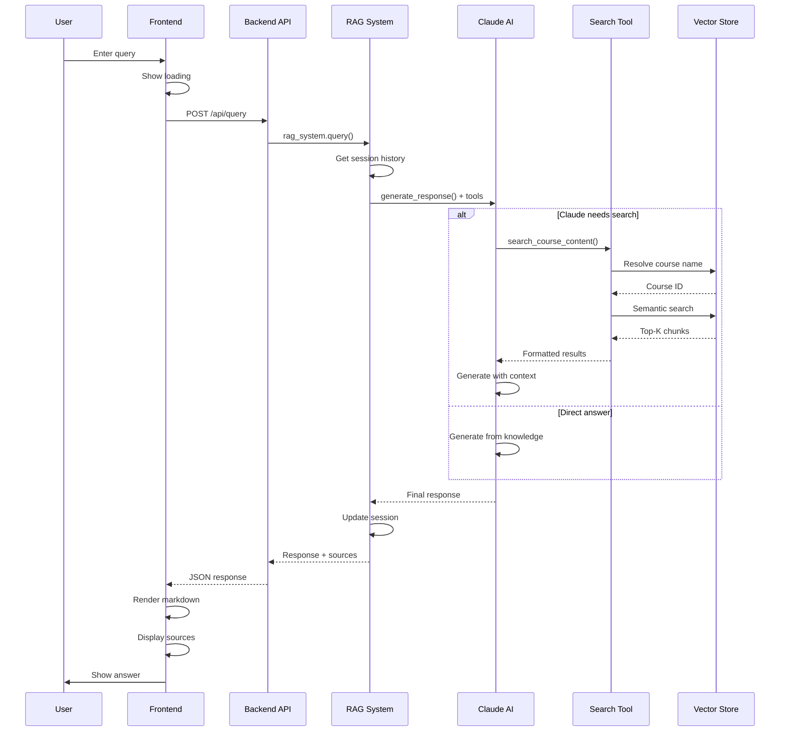
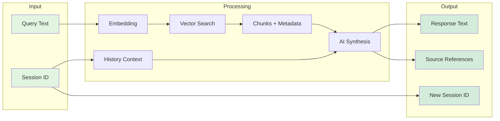

# RAG Chatbot Query Flow Diagram

## Complete Query Processing Flow

```mermaid
graph TB
    subgraph "Frontend (Browser)"
        A[User Types Query] --> B[Click Send/Enter]
        B --> C[sendMessage]
        C --> D[Show Loading Animation]
        D --> E[POST /api/query]
        
        style A fill:#e1f5e1
        style B fill:#e1f5e1
        style C fill:#fff2cc
        style D fill:#fff2cc
        style E fill:#ffcccc
    end
    
    subgraph "Backend API (FastAPI)"
        E --> F[app.py: query_documents]
        F --> G{Session ID?}
        G -->|No| H[Create New Session]
        G -->|Yes| I[Use Existing Session]
        H --> J[rag_system.query]
        I --> J
        
        style F fill:#cce5ff
        style G fill:#cce5ff
        style H fill:#cce5ff
        style I fill:#cce5ff
        style J fill:#ffcccc
    end
    
    subgraph "RAG System Layer"
        J --> K[Get Conversation History]
        K --> L[Prepare Tool Definitions]
        L --> M[ai_generator.generate_response]
        
        style K fill:#f0e6ff
        style L fill:#f0e6ff
        style M fill:#ffcccc
    end
    
    subgraph "AI Generation (Claude)"
        M --> N[Add System Prompt]
        N --> O[Claude API Call]
        O --> P{Tool Needed?}
        P -->|Yes| Q[Request Tool Use]
        P -->|No| R[Direct Response]
        
        style N fill:#ffe6e6
        style O fill:#ffe6e6
        style P fill:#ffe6e6
        style Q fill:#ffcccc
        style R fill:#d4edda
    end
    
    subgraph "Tool Execution"
        Q --> S[CourseSearchTool.execute]
        S --> T[Resolve Course Name]
        T --> U[Build Filter]
        U --> V[Vector Search]
        
        style S fill:#fff0e6
        style T fill:#fff0e6
        style U fill:#fff0e6
        style V fill:#ffcccc
    end
    
    subgraph "Vector Store (ChromaDB)"
        V --> W[Query Embeddings]
        W --> X[Semantic Search]
        X --> Y[Return Top-K Chunks]
        Y --> Z[Format Results]
        
        style W fill:#e6f3ff
        style X fill:#e6f3ff
        style Y fill:#e6f3ff
        style Z fill:#e6f3ff
    end
    
    subgraph "Response Flow"
        Z --> AA[Tool Results to Claude]
        R --> AB[Generate Final Answer]
        AA --> AB
        AB --> AC[Track Sources]
        AC --> AD[Update Session History]
        AD --> AE[Return Response JSON]
        
        style AA fill:#ffe6e6
        style AB fill:#ffe6e6
        style AC fill:#f0e6ff
        style AD fill:#f0e6ff
        style AE fill:#d4edda
    end
    
    subgraph "Frontend Display"
        AE --> AF[Remove Loading]
        AF --> AG[Parse Markdown]
        AG --> AH[Display Response]
        AH --> AI[Show Sources]
        AI --> AJ[Update Session ID]
        AJ --> AK[Re-enable Input]
        
        style AF fill:#fff2cc
        style AG fill:#fff2cc
        style AH fill:#e1f5e1
        style AI fill:#e1f5e1
        style AJ fill:#fff2cc
        style AK fill:#e1f5e1
    end
```

## Component Interaction Sequence

## Data Flow Summary

## Key Components

| Layer | Component | Responsibility |
|-------|-----------|---------------|
| **Frontend** | script.js | UI interaction, API calls |
| **API** | app.py | Request routing, session management |
| **RAG** | rag_system.py | Orchestration, tool management |
| **AI** | ai_generator.py | Claude API, tool execution |
| **Tools** | search_tools.py | Search interface, result formatting |
| **Vector DB** | vector_store.py | Semantic search, embeddings |
| **Storage** | ChromaDB | Persistent vector storage |

## Performance Characteristics

- **Typical Latency**: 2-5 seconds end-to-end
- **Vector Search**: ~100-200ms
- **Claude Response**: 1-3 seconds
- **Embedding Generation**: ~50ms per chunk
- **Session Overhead**: <10ms

## Color Legend

- 🟢 Green: User interaction points
- 🟡 Yellow: Processing/transformation
- 🔴 Red: External API calls
- 🔵 Blue: Data storage operations
- 🟣 Purple: Session/state management
- 🟠 Orange: Tool execution